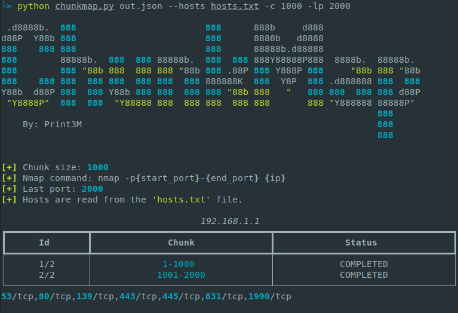

# 1. ChunkMap

- [1. ChunkMap](#1-chunkmap)
  - [1.1. Overview](#11-overview)
  - [1.2. Installation](#12-installation)
  - [1.3. Usage](#13-usage)
    - [1.3.1. New scan](#131-new-scan)
    - [1.3.2. Chunking](#132-chunking)
    - [1.3.3. Interrupt and resume scan](#133-interrupt-and-resume-scan)
    - [1.3.4. Extra Nmap parameters](#134-extra-nmap-parameters)
    - [1.3.5. Scan range](#135-scan-range)

## 1.1. Overview
Nmap is cool, but it has the disadvantage that it can mysteriously slow down terribly during large scans. The problem is often solved by splitting one large scan into several smaller ones. This is precisely the task of the ChunkMap tool. It allows the full range of ports (+65k) to be split into chunks of a defined size. After each chunk, the result is saved to a file on the fly. Each scan can be interrupted at any time and resumed later.



## 1.2. Installation

> NOTE: **Python version >= 3.10 is required!**

1. Clone this repository: `git clone <this-repo>; cd <this-repo>`
2. Install Python dependencies: `pip install -r requirements.txt`
3. Run the script: `python chunkmap.py --help`

## 1.3. Usage

Show help info:

```bash
chunkmap.py --help
```

### 1.3.1. New scan

The output file is always required. This is the file where results of a scan are saved and it's used to resume a scan. Hosts to be scanned are always read from the file specified in `--hosts <hosts-file>` parameter. This parameter is used to start a new scan. The hosts file should contain one hostname or IP address per line.

```bash
# Read hosts from 'hosts.txt' file
chunkmap.py out.json --hosts hosts.txt
```

### 1.3.2. Chunking

The fundamental feature of ChunkMap tool is dividing a standard nmap scan into chunks. The current progress of the entire scan is saved after each chunk and can be resumed. Chunk size can be specified using `-c <number>` parameter. For example, using `-c 1000` parameter a new Nmap scan will be started after every 1000 ports.

```bash
# Use chunk of size equals 1000 ports
chunkmap.py out.json --hosts hosts.txt -c 1000
```

### 1.3.3. Interrupt and resume scan

To interrupt currently executed scan use `ctrl + c` shortcut. You can choose if you want to skip this host (mark it as COMPLETED) or resume it later (mark it as IN_PROGRESS).

To resume an previously interrupted scan use `--resume <output-file>` parameter. The file provided to the parameter should be in format of an ChunkMap output file. Note that every resume can be actually performed using different parameters if needed.

```bash
# Resume 'output.json' scan
chunkmap.py out.json --resume output.json -c 1000
```

### 1.3.4. Extra Nmap parameters

To specify additional Nmap parameters use `-x '<params>'` parameter. This parameters are passed to the every Nmap scan executed internally.

```bash
# Use Nmap '--max-rate' parameter
chunkmap.py out.json --hosts hosts.txt -x '--max-rate 100'
```

### 1.3.5. Scan range

To specify last port to be scanned use `-lp <number>` parameter. For example, using `-lp 15000` parameter Nmap scans will be executed in the 1-15000 ports range (using chunks of course if specified).

```bash
# Last scanned port = 15000
chunkmap.py out.json --hosts hosts.txt -lp 15000
```
